# Plan de Desarrollo — ro_inventario

POS interno de papelería. Rust + Axum + sqlx + Askama + htmx + Alpine.js + Bootstrap 5.
Reemplaza `inventario_papeleria` (ASP.NET Core MVC). Misma BD PostgreSQL, cutover único cuando todo esté validado.

---

## Mapa de módulos

```mermaid
graph LR
    subgraph "Fase 0 — Infraestructura"
        A0["Axum mínimo"]
        A1["sqlx + PostgreSQL"]
        A2["Auth: login/logout\naxum-login + tower-sessions"]
        A3["Containerfile ARM64\nGitHub Actions"]
    end

    subgraph "Fase 1 — Ventas"
        B1a["1a: Backend Rust\nAskama templates"]
        B1b["1b: Frontend Alpine.js\nreemplaza KnockoutJS"]
    end

    subgraph "Fase 2 — Compras"
        C1["CompraRepository\nOrdenCompraRepository"]
    end

    subgraph "Fase 3 — CRUD"
        D1["Proveedores"]
        D2["Clientes + monedero"]
        D3["Productos + fotos MinIO"]
        D4["Pedidos"]
        D5["Órdenes de compra"]
        D6["Ajustes / inventario"]
        D7["Toners"]
    end

    subgraph "Fase 4 — Reportes"
        E1["Dashboard + ingresos\nChart.js"]
    end

    subgraph "Fase 5 — Cutover"
        F1["Validación staging"]
        F2["Apagar .NET\nArrancar Rust en producción"]
    end

    A0 --> A1 --> A2 --> B1a
    A3 --> B1a
    B1a --> B1b --> C1 --> D1
    D1 --> D2 --> D3 --> D4 --> D5 --> D6 --> D7 --> E1 --> F1 --> F2
```

---

## Fase 0 — Infraestructura base

Prerequisito de todo lo demás.

- [ ] `cargo init`, dependencias: axum, sqlx (features: postgres, uuid, chrono, rust_decimal), tokio, tower-http, askama, axum-login, tower-sessions, tower-sessions-sqlx-store, rust-decimal (feature: db-postgres), tracing, tracing-subscriber, dotenvy, anyhow, thiserror, serde, serde_json, reqwest, aws-sdk-s3
- [ ] Estructura de directorios: `src/`, `src/auth/`, `src/db/`, `src/modules/`, `templates/`, `static/`
- [ ] `config.rs` — `DATABASE_URL`, `PORT`, `SESSION_SECRET`, `CONTENT_BASE_URL`
- [ ] `error.rs` — `AppError` que implementa `IntoResponse`
- [ ] Pool sqlx: `db/mod.rs`
- [ ] Template base `templates/base.html` — Bootstrap 5, htmx y Alpine.js desde CDN
- [ ] Sesiones: tower-sessions con PostgreSQL store (tabla propia, independiente del .NET)
- [ ] Auth completo: `auth/backend.rs` (axum-login), `GET /login`, `POST /login`, `GET /logout`
- [ ] Middleware de autenticación — proteger todas las rutas excepto login
- [ ] `GET /` → redirect a `/ventas`
- [ ] `Containerfile` multi-stage ARM64
- [ ] `.env.example`
- [ ] GitHub Actions: build ARM64 + push a `ghcr.io`
- [ ] ArgoCD configurado (deploy a staging, no a producción aún)

## Fase 1a — Ventas (backend Rust, templates Askama)

Backend completo de ventas. El JS del .NET se copia temporalmente a `static/` sin reescribir.

- [ ] `modules/ventas/models.rs` — structs `Venta`, `VentaLinea`, `AjusteResumen`
- [ ] `modules/ventas/queries.rs` — equivalente a `AjusteRepository` del .NET
  - [ ] Listado paginado de ventas
  - [ ] Detalle de venta por Id
  - [ ] Crear venta (INSERT en `Ajustes` + `AjustesProductos` + `MonederoGenerados`)
  - [ ] Tipo de cambio USD vía Banxico (reqwest)
- [ ] `modules/ventas/routes.rs`
  - [ ] `GET /ventas` — listado con filtros (htmx)
  - [ ] `GET /ventas/nueva` — formulario nueva venta
  - [ ] `POST /ventas/crear` — crear venta
  - [ ] `GET /ventas/:id` — detalle de venta
  - [ ] Endpoints JSON que consume el frontend (productos, tipo de cambio, settings)
- [ ] Templates Askama en `templates/ventas/`
- [ ] Validar reglas de negocio:
  - [ ] Comisión por tarjeta (cálculo iterativo en dos pasos)
  - [ ] Monedero aplicado como pago
  - [ ] Tipo de cambio dólares
  - [ ] Cambio entregado (solo efectivo y dólares)
  - [ ] `MonederoGenerado` por línea si `TipoAjuste=0` y `ClienteId IS NOT NULL`

## Fase 1b — Ventas (frontend Alpine.js)

Cuando 1a esté validado en staging.

- [ ] Reemplazar KnockoutJS con Alpine.js en la página de nueva venta
- [ ] htmx para listado de ventas y detalle
- [ ] Eliminar dependencia del JS legado en este módulo

## Fase 2 — Compras

- [ ] `modules/compras/models.rs`
- [ ] `modules/compras/queries.rs` — equivalente a `CompraRepository` + `OrdenCompraRepository`
- [ ] Rutas: listado, detalle, crear compra
- [ ] Templates: Askama + htmx para listados, Alpine.js para formulario de compra
- [ ] Validar: estado de `OrdenCompra` inferido de fechas (no del campo `Estatus`)

## Fase 3 — Módulos CRUD

En orden de complejidad. Principalmente htmx + Askama sin lógica de negocio compleja.

- [ ] **Proveedores** — CRUD básico
- [ ] **Clientes** — CRUD + lógica de monedero (balance, historial, expiración)
- [ ] **Productos** — CRUD + fotos MinIO (aws-sdk-s3 para upload)
- [ ] **Pedidos** — listado y conversión a venta
- [ ] **Órdenes de compra** — CRUD + estados inferidos
- [ ] **Ajustes / inventario** — mermas, ingresos sin compra; siempre usar `v_stock`
- [ ] **Toners** — CRUD con `TipoColor` Flags

## Fase 4 — Reportes y dashboard

- [ ] Dashboard con resumen de ventas del día / semana / mes
- [ ] Vista de ingresos mensuales (usar `v_ingresos_mensuales`, no reconstruir)
- [ ] Stock bajo / alertas
- [ ] Chart.js para gráficas (sin cambio vs .NET)

## Fase 5 — Cutover a producción

- [ ] Validación completa de todos los módulos en staging
- [ ] Apagar `.NET` app en k3s
- [ ] Arrancar `ro_inventario` apuntando a la misma BD y MinIO de producción
- [ ] Smoke test: login, venta completa, compra, reportes
- [ ] Si hay rollback: apagar Rust, encender .NET (la BD no cambia de esquema)

---

> Marcar cada item con `[x]` al completarlo.
