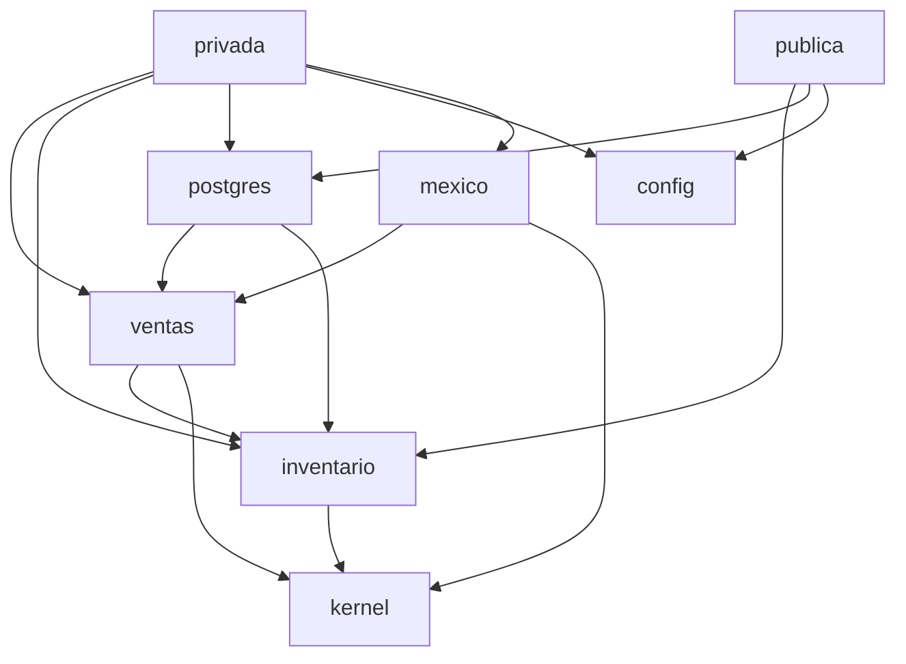

# Un crate por área del negocio, y el compilador vigila las dependencias

**Fecha:** 2026-09-29 · **Estado:** vigente

## Contexto
En la versión uno las reglas del negocio acabaron repartidas entre vistas SQL, TypeScript y C#, y una sola clase de ventas llegó a ~1,460 líneas. Nada impedía mezclar cálculo de pagos, acceso a datos y pantalla en el mismo archivo: dependía de la disciplina de quien escribía. Aquí queremos que lo impida el compilador, sin llenar el proyecto de capas y ceremonia para una sola persona.

## Decisión
**Un workspace de Cargo** con tres tipos de crate:

```
crates/
  kernel/         tipos que comparten todas las áreas: Dinero, Cantidad, ids tipados, errores
  inventario/     área del negocio: productos, servicios y sus recetas, stock, costos
  ventas/         área del negocio: venta, formas de pago, comisiones
  compras/        …una por área, creada cuando se necesita
  mexico/         servicios externos de México: tipo de cambio de Banxico; después SAT/PAC (CFDI), SPEI, CoDi
  config/         lectura y validación de negocio.toml
  postgres/       implementación de los repositorios de todas las áreas, y las migraciones
apps/
  privada/        binario: punto de venta (rutas, plantillas, arma las piezas al arrancar)
  publica/        binario: catálogo, monedero, recibos, pedidos en línea
tools/
  migracion-v1/   binario: copia los datos de la versión uno a la base nueva
e2e/              pruebas Playwright de las dos aplicaciones
```

**Las reglas de dependencia** (quedan escritas en cada `Cargo.toml`, y romperlas no compila). Diagrama simplificado con dos áreas:



1. **Las áreas del negocio son puras.** `inventario`, `ventas`, etc. dependen solo de `kernel` y de otras áreas. No tienen como dependencia `sqlx`, `axum` ni ninguna librería de red o de base de datos: una consulta SQL o una respuesta HTTP en una regla del negocio **no compila**.
2. **Cada área define los traits que necesita** (`VentasRepo`, `TipoCambioProvider`…) y no sabe quién los implementa. Eso es la inversión de dependencias.
3. **`postgres` y `mexico` implementan esos traits.** Así las áreas se prueban sin base de datos ni servicios externos. Dependen de las áreas, nunca al revés.
4. **Las aplicaciones solo arman y conectan:** leen la configuración, eligen las implementaciones, registran rutas y muestran plantillas. Sin reglas del negocio.
5. **Las dependencias entre áreas van en un solo sentido** (ventas conoce inventario; inventario no conoce ventas). Cargo no permite ciclos entre crates, así que un ciclo obliga a replantear la frontera.

**Pruebas por tipo de crate:**
- Áreas: pruebas unitarias sin base de datos. Cada área trae implementaciones de prueba de sus traits (en memoria), y las mismas pruebas de contrato corren contra la de prueba y contra la de `postgres`.
- `postgres`: pruebas de integración contra una base de pruebas real, incluidas las migraciones.
- Aplicaciones: E2E con Playwright en `e2e/`.

**Crecimiento:** un área nueva es un crate nuevo. Si un área empieza a cambiar por dos motivos distintos, se parte en dos crates. Los nombres siguen la regla del proyecto: áreas del negocio en español (`ventas`), piezas técnicas en inglés (`kernel`, `config`, `postgres`).

## Descartado
- **Por capas** (`domain`, `db`, `web`): simple al inicio, pero todo el negocio termina en un crate enorme donde nada separa ventas de compras.
- **Un crate por área *y por capa*** (`ventas`, `ventas-db`, `ventas-web`…): la separación más estricta, pero triplica los crates y el trabajo de mantenerlos para una sola persona.
- **Un solo crate con módulos** (como `xplaya`): el compilador no impide que un módulo use a cualquier otro; la separación vuelve a depender de la disciplina.

## Consecuencias
- **Lo que el compilador garantiza:** las reglas del negocio no dependen de la base de datos, de la web ni de servicios externos; las áreas no forman ciclos.
- **Lo que no garantiza:** que la aplicación pública no escriba. Depende de `postgres`, que también tiene repositorios que escriben. La barrera ahí es su **usuario de base de datos con permisos mínimos** (leer, y solo insertar pedidos en línea), más la revisión. Si algún día hace falta que lo impida el compilador, `postgres` se parte en lectura y escritura.
- `postgres` crece con cada área. Se organiza por carpetas por área; si pasa del límite de tamaño, se parte por área.
- Los crates se crean cuando se necesitan, no todos el primer día: el corte mínimo empieza con `kernel`, `config`, `postgres`, `privada` y las áreas de ventas, compras, inventario y usuarios.
- Una sola versión de cada dependencia para todo el workspace (`[workspace.dependencies]`) y un solo `Cargo.lock`.
